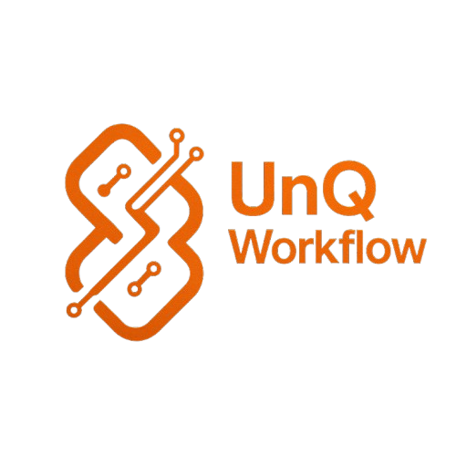

# UnQWorkFlow 🚀

[](https://colab.research.google.com/github/Sandeepgaddam5432/unq-content-flow/blob/main/video_generator.ipynb)

An AI-powered autonomous content creation and management platform designed to streamline workflows for YouTube and Instagram creators. Built with a modern tech stack and a focus on a seamless user experience.



---

## ✨ Key Features

- **AI-Powered Content Generation:** Create videos and scripts from simple text prompts.
- **Multi-Channel Management:** Connect and manage multiple YouTube and Instagram accounts seamlessly.
- **Advanced Dashboard:** Real-time analytics, content status, and performance metrics.
- **Modern UI/UX:** A stunning glassmorphism interface with a command palette (`Cmd+K`) for rapid navigation.
- **Dynamic & Responsive:** Built with Tailwind CSS for perfect responsiveness on all devices.
- **Robust Tech Stack:** Fully type-safe with TypeScript, ensuring a stable and maintainable codebase.
- **Micro-interactions:** Subtle animations and skeleton loaders for a premium user experience.

## 🛠️ Tech Stack

- **Frontend:** React, TypeScript, Vite
- **Styling:** Tailwind CSS
- **UI Components:** Shadcn/ui
- **State Management:** Zustand
- **Animations:** Framer Motion (or custom Tailwind animations)
- **AI Integration:** Real-time connection to Google Colab via Cloudflare Tunnels

## 🎬 AI Video Generation Engine (Backend)

This project uses a Google Colab notebook as a live, GPU-powered backend server. It connects to our frontend application in real-time using a secure Cloudflare Tunnel.

### How It Works

1. **Click the "Open in Colab" button** above to open the notebook.
2. **Run All Cells:** In Colab, go to `Runtime > Run all`. This will mount your Google Drive, install dependencies, and download the AI models (this happens only once).
3. **Get Your Backend URL:** The final cell will start a web server and generate a public URL that looks like `https://something-random.trycloudflare.com`.
4. **Connect the Frontend:** Copy this unique URL. Go to your UnQWorkFlow website, find the "Backend Settings" or "Connect to AI Engine" section, and paste the URL there.
5. **Start Creating!** Once connected, you can start generating videos directly from the website. The Colab notebook will process your requests in real-time.

**Important:** The Colab notebook must remain running for the backend to be active. If the Colab session ends, you will need to re-run the notebook to get a new URL.

## 🚀 Getting Started

Follow these steps to get a local copy up and running.

### Prerequisites

Make sure you have `bun` installed on your machine.
- [Bun Installation Guide](https://bun.sh/docs/installation)

### Installation

1.  Clone the repository:
    ```sh
    git clone https://github.com/Sandeepgaddam5432/unq-content-flow.git
    ```
2.  Navigate to the project directory:
    ```sh
    cd unqworkflow
    ```
3.  Install dependencies:
    ```sh
    bun install
    ```
4.  Run the development server:
    ```sh
    bun dev
    ```
The application will be available at `http://localhost:5173`.

## 🚢 Deployment

This project is optimized for deployment on **Vercel**.

1.  Push your code to your GitHub repository.
2.  Go to your Vercel dashboard and import the project from GitHub.
3.  Vercel will automatically detect the Vite configuration and deploy the application.

## 👤 Author

**Sandeep Gaddam**

## 📄 License

This project is licensed under the MIT License. See the `LICENSE` file for details.
